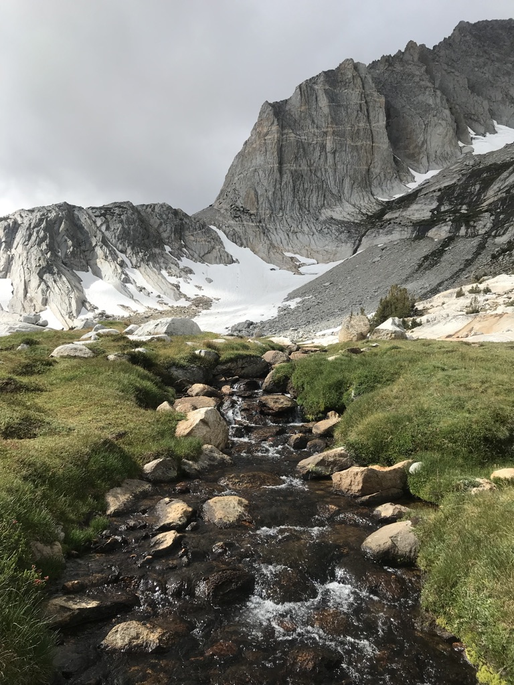
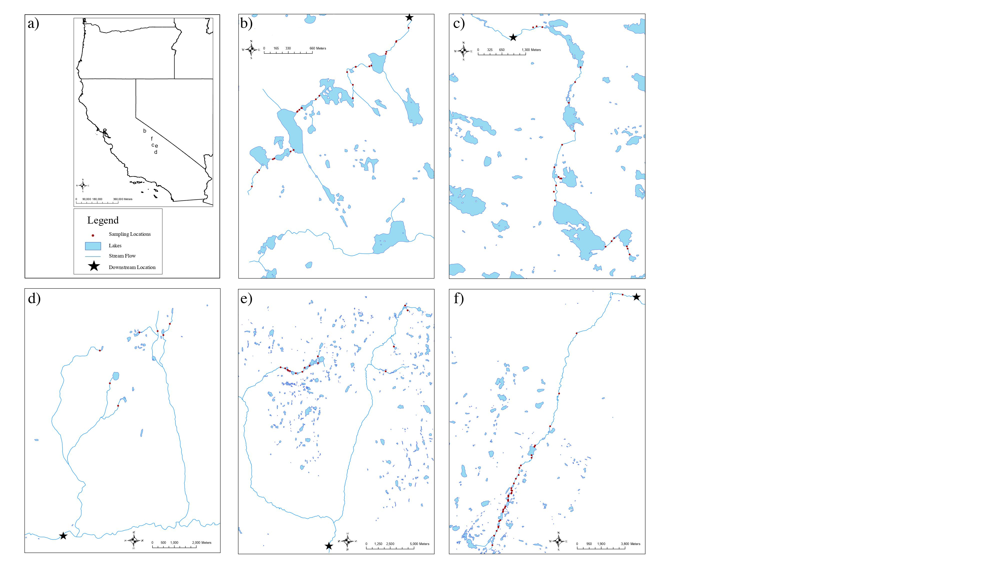
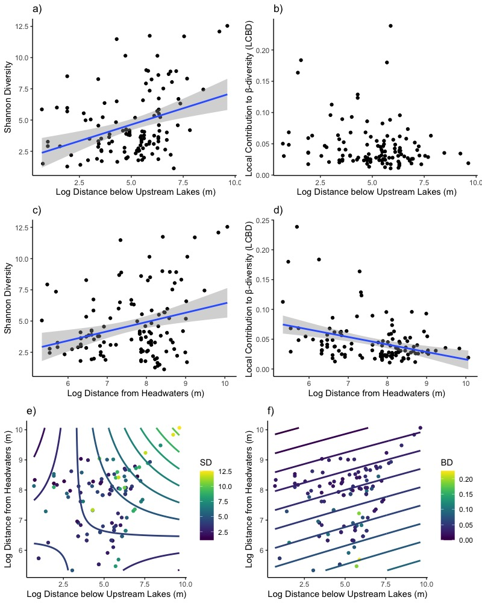
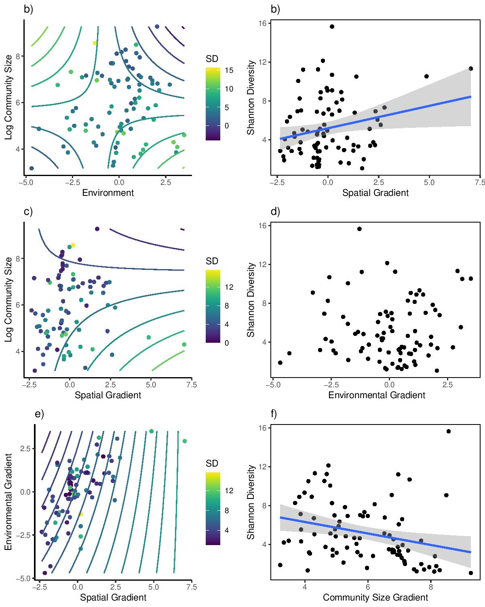
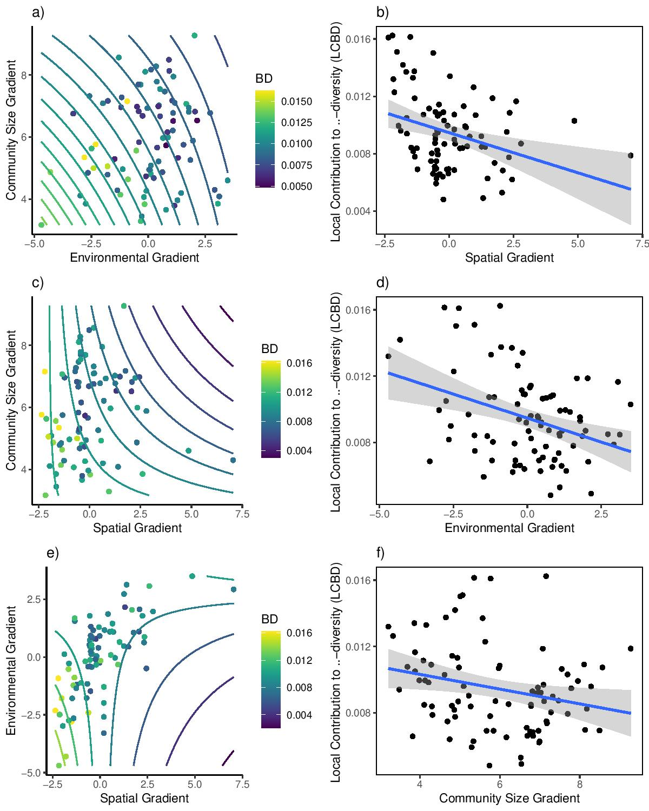

# Rethinking Biodiversity Patterns and Processes in Stream Ecosystems, in press Ecological Monographs

Authors: Matthew D. Green, Kurt E. Anderson, Marko J. Spasojevic, and David B. Herbst

## Supplemental Photo: Photo of Sampling Site in the Sierra Nevada, CA (pc: Matthew D. Green)

# Methods 
## Figure 1:Maps of Sampling Locations

# Results

## Figure 2: Results from Biodiveristy Frameworks in Stream Ecology

## Figure 3/4: Reuslts from Theory of Ecological Communities Framework

