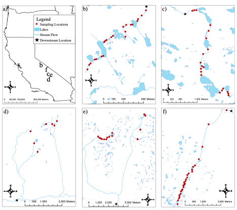

# Rethinking Biodiversity Patterns and Processes in Stream Ecosystems, Ecological Monographs

Authors: Matthew D. Green, Kurt E. Anderson, David B. Herbst, and Marko J. Spasojevic

Article Link: https://esajournals.onlinelibrary.wiley.com/doi/epdf/10.1002/ecm.1520

## Supplemental Photo: Photo of Sampling Site in the Sierra Nevada, CA (pc: Matthew D. Green)

# Methods 
## Figure 1:Maps of Sampling Locations

# Results

## Results from Biodiveristy Frameworks in Stream Ecology

#### Figure 2:

## Reuslts from Theory of Ecological Communities Framework

#### Figure 3:

#### Figure 4: 

