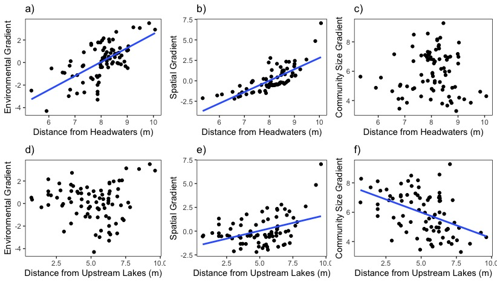

# Rethinking_Biodiversity_Streams
Analysis for Rethinking Biodiversity in Stream Ecosystems

Authors: Matthew D. Green, Kurt E. Anderson, Marko J. Spasojevic, and David B. Herbst

#Photo of Sampling Site in the Sierra Nevada, CA (pc: Matthew D. Green)

# Results

#Figure 2: 

